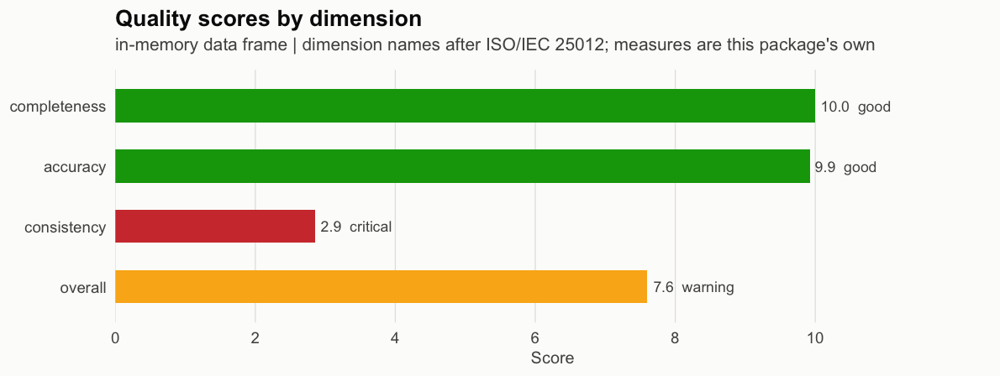
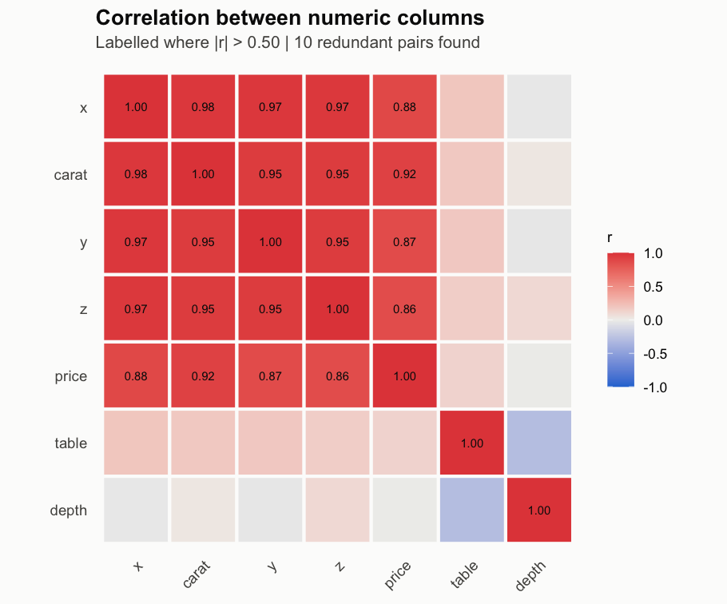

# datagrade

Point it at a data frame. Get a score.

`datagrade` assesses the quality of a tabular data set and scores it on four
dimensions — completeness, accuracy, consistency and timeliness — then returns a
report object with tables and figures. No configuration, no metadata file, no
rules to write first.

That last part is the point. The existing R packages for data quality
(`DQA`, `DQAstats`, `dataquieR`) all require a metadata repository or data
dictionary before they will run. `datagrade` runs on anything with columns.

## Install

```r
# install.packages("remotes")
remotes::install_github("ohalukdemirhan/datagrade")
```

## Use

```r
library(datagrade)

report <- dg_assess(ggplot2::diamonds)
```

```
── Data quality report ─────────────────────────────────────────────────
Source: in-memory data frame
Size: 53940 rows x 10 columns
Elapsed: 0.15s

── Scores ──

• completeness: 10.0/10 (100%) - good
• accuracy: 9.9/10 (99.3%) - good
• consistency: 2.9/10 (28.6%) - critical
• timeliness: not applicable

Overall: 7.6/10 (75.9%) - warning

── Findings ──

• Missing values: 0 across 0 columns
• Duplicate rows: 146 (0.27%)
• Outliers (z_score): 2798 of 377580 numeric values
• Redundant pairs above |r| > 0.5: 10 (strongest carat~x at 0.98)
• Suggested to drop: carat, price, x, and y
• VIF above 5: carat, price, x, y, and z
```

The printout is a side effect. The object is the product:

```r
report$scores            # named vector, 0-10
report$redundancy$pairs  # data frame of correlated column pairs
summary(report)$columns  # per-column type, missingness, outliers, VIF
as.data.frame(report)    # one row, for stacking across many data sets
```

Figures come from `dg_plots(report)`:





Also works on files — `dg_assess(path = "data.csv")` — for `.csv`, `.tsv`,
`.txt`, `.xls` and `.xlsx`.

## It scales

Benchmarked on `ggplot2::diamonds` (53,940 × 10, MIT licensed), then the same
real data replicated with jitter. R 4.5.2, macOS arm64, single core.

| Rows | Input size | Full assessment | Figures | Report object |
|---:|---:|---:|---:|---:|
| 53,940 | 3.5 MB | 0.12 s | 0.11 s | 82 KB |
| 500,000 | 34 MB | 1.40 s | 0.10 s | 84 KB |
| 1,000,000 | 68 MB | 2.99 s | 0.10 s | 83 KB |
| 5,000,000 | 340 MB | 17.08 s | 0.11 s | 83 KB |
| **10,000,000** | **680 MB** | **38.04 s** | **0.12 s** | **83 KB** |

Cost per row is 1.37 µs at 54 thousand rows and 0.94 µs at 10 million — it goes
*down*, because fixed startup amortises. The input grows 185-fold; the report
object grows 1%, because it holds statistics and never the data. Figures render
in constant time at every size. Scores are identical at every size, which is how
you know the subsampling isn't biasing anything.

Reproduce it yourself: `Rscript inst/bench/benchmark.R`.

Three dependencies: `cli`, `ggplot2`, base R.

## Documentation

Everything technical lives in the vignettes, not here.

- `vignette("datagrade")` — the full walkthrough
- `vignette("methodology")` — every formula, written out
- `vignette("scalability")` — how the numbers above are achieved
- `vignette("deviations")` — how this differs from the dissertation it implements

## Background

This implements the framework from:

> Demirhan, O. H. (2024). *Assessing Data Quality Management Issues in
> Open-Sourced Data Sets with Statistical Methodology.* MSc dissertation,
> University of Greenwich.

The four dimension **names** follow the ISO/IEC 25012 data quality model. The
**measures** are this package's own — they are not ISO/IEC 25024 conformant
measures, and the package does not claim to be. `vignette("methodology")`
explains exactly what conformance would require and why zero-configuration
assessment cannot deliver it.

Numbers here will not always match numbers in the dissertation.
`vignette("deviations")` lists every difference and the reason for it.

## v1 vs v2

| | v1 — this release | v2 — planned |
|---|---|---|
| Input needed | a data frame, nothing else | data frame, plus an optional `dg_spec()` |
| Measures | this package's own, each documented | ISO/IEC 25024 form, `X = A/B` over counted elements |
| Accuracy | outliers against a *derived* interval (μ ± 3σ, or the IQR fence) | values against a *specified* interval from the spec |
| Completeness | mean missing rate across columns | non-null items ÷ items declared required |
| Consistency | share of columns with VIF ≤ 5 | contradiction and referential checks; collinearity split out as its own measure |
| Fourth dimension | `timeliness`, the dissertation's word | `currentness`, ISO's word; `timeliness` kept as an alias |
| `credibility` | not measured | measured |
| Scale | 0–10 | `[0.0, 1.0]` ratio per ISO, presented on 0–10 |
| Aggregation | weighted mean over applicable dimensions | unchanged — ISO/IEC 25024 does not specify aggregation |

v2 does not replace v1. Without a spec it behaves exactly as v1 does; supplying
one unlocks the measures that need a declared expectation to be computable at
all. Both matter, because most open data arrives with no data dictionary — which
is the situation v1 exists for.

## References

The ISO claims above are sourced. The standards themselves are paywalled, so
their *structure* is cited from the peer-reviewed literature and the individual
measure identifiers and formulas are **not** reproduced here — they could not be
verified without the documents.

- ISO/IEC 25024:2015. *Systems and software engineering — Systems and software
  Quality Requirements and Evaluation (SQuaRE) — Measurement of data quality.*
  International Organization for Standardization.
  <https://www.iso.org/standard/35749.html>
- ISO/IEC 25012:2008. *Software engineering — SQuaRE — Data quality model.*
  International Organization for Standardization.
  <https://www.iso.org/standard/35736.html>
- Gualo, F., Rodriguez, M., Verdugo, J., Caballero, I. and Piattini, M. (2021).
  'Data Quality Certification using ISO/IEC 25012: Industrial Experiences',
  *Journal of Systems and Software*. <https://arxiv.org/abs/2102.11527> —
  source for the `X = A/B` measurement-function form, for the Accuracy Range
  (RAN_EXAC) measure whose element *B* is "the number of data items for which
  a required interval of values can be defined", and for the statement that
  ISO/IEC 25024 does not specify how measures aggregate into a
  per-characteristic score. Written by an ISO/IEC 25012 accredited evaluation
  laboratory.
- Calabrese, J., Esponda, S. and Pesado, P. (2020). 'Framework for Data Quality
  Evaluation Based on ISO/IEC 25012 and ISO/IEC 25024', *8th Conference on
  Cloud Computing, Big Data & Emerging Topics*, Universidad Nacional de La
  Plata. <https://sedici.unlp.edu.ar/handle/10915/104778> — source for the five
  inherent characteristics being Accuracy, Completeness, Consistency,
  Credibility and **Currentness**.
- ISO 25000 Portal. *ISO/IEC 25012 — Data Quality Model.*
  <https://iso25000.com/index.php/en/iso-25000-standards/iso-25012>

Building v2 properly requires the standard's Annexes A–E (the synoptic table of
quality measure elements, the measures by element and target entity, and the
alphabetic measure list). Those are not in any public source.

## Licence

MIT © Omer Haluk Demirhan
